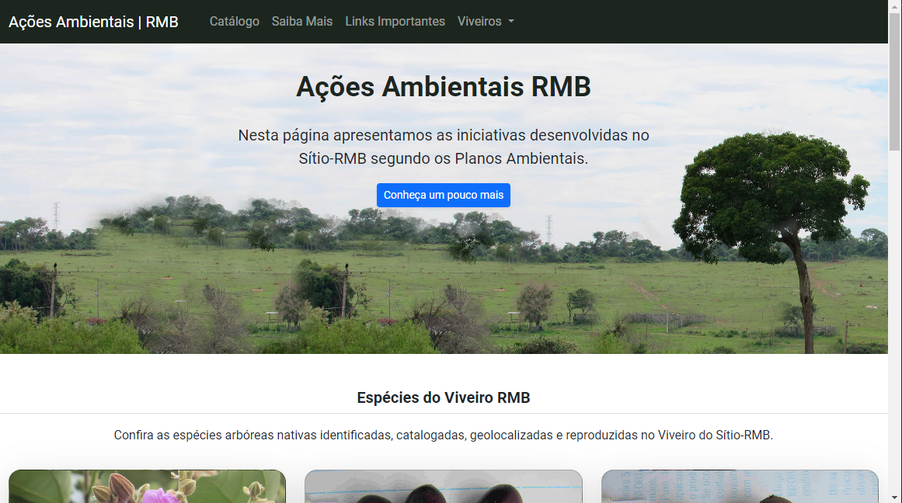

<h2> Ações Ambientais RMB</h2>

> Este repositório contém o projeto desenvolvido para documentar e disponibilizar de fácil acesso as atividades exercídas no sítio rmb.

<h3> 📁 Conteúdo</h3>

O portal ainda está em desenvolvimento e as próximas atualizações viram conforme a solicitação de inclusão de seções.

- [x] Section - Apresentação Inicial e logo;
- [x] Section - Viveiro de mudas e espécies catalogadas;
- [x] Section - Avistamento de fauna no entorno do sítio;
- [x] Section - Links importantes para o empreendimento e textos explicativos;
- [x] Section - Adição dos mapas dos viveiros;
- [ ] Section - Seção Sítio arqueológico;
- [ ] Section - Mapa das matrizes;
